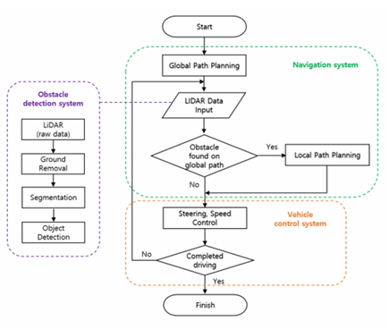

# 장애물 회피

## Basic Algorithm of Autonomous Driving

> 라이다를 이용한 장애물 검출 및 자동차 경로계획에 관한 연구.pdf
>
> [Figure 1.][1]

장애물 회피를 위해서 크게 Obstacle Detection과  Navigation을 나눌 수 있으며 

Obstacle Detection에서는 Clustrering - Obstacle detection - Calculating obstacle distance으로 나눌 수 있다.

Navigation System에서는 Global Path Planning / Local Path Planning 으로 나눌 수 있다.

---

## Obstacle Detection

  Obstacle Detection시 장애물과 지면이 붙어있을 경우 하나의 객체로 묶인다. 이 경우 장애물의 수를 정확히 파악하기 어렵기 때문에 군집화의 전처리 과정이 필요하다. 더불어, 오르막길이나 먼 거리의 도로의 검출을 고려해 z축으로 0.5 [m] 이하 범위에 해당하는 Point Cloud는 지면으로 간주하여 제거한다. 

> 라이다를 이용한 장애물 검출 및 자동차 경로계획에 관한 연구.pdf
>
> [Figure 2.][1]
>
> [][1]

### Clustering

---

####  - K-means Clustering 

  주어진 데이터를 k개로 묶는 알고리듬. 각 객체의 분산을 최소화 하도록 함.

  i번째 객체의 중심 $\mu_i$, 객체에 속하는 점의 집합 $S_i$, 전체분산 $V$의 식은 다음과 같다.
$$
V = \sum_{i=1}^k \sum_{j \in S_i} |x_j - \mu_i|^2
$$

> [Figure 3.][1]

> 원래 분산의 의미를 생각하면 저 식에는 오류가 있다. 정확한 분산에 대한 표현은 아니다.
>
> 분산이란, 관측값에서 평균을 뺀 값을 제곱하고, 그것을 모두 더한 후 전체 개수로 나눠서 구하는 것이다.
>
> 하지만 전체 개수로 나누는 항이 빠졌고 이를 표현한 제대로 된 분산식은 다음과 같다.
> $$
> V_{\text{평균}} = \frac{1}{k} \sum_{i=1}^k \frac{1}{|S_i|} \sum_{j \in S_i} |x_j - \mu_i|^2
> $$
>   $S_i$에 대한 항이 빠질 수 있던 이유는 어쨌든 중심값과의 거리가 가장 짧은 분산이 필요한 것이기 때문에 $k, S_i$ 두 항은 하나의 곱셈상수로 표현할 수 있다.
>
> 즉, 이는 $V$를 최소화 하는 $S_i$를 찾는 것이 목적이기 때문에 곱셈상수는 필요 없는 것이다.

> K-means Clustering Flow Chart
>
> [Figure 4.][1]

  **<K-means Clustering 과정>**

1. cluster의 **개수를 선정**한다. 이 개수는 직접 정해주어야 하는 것이다.

2. cluster의 **centroid**를 랜덤하게 **지정**한다. (지정 방법에도 여러 방법이 있고 능률을 향상 시키는데에 있어 주요한 요인이다.)

3. 각각의 **데이터 포인트**들과 군집의 **centroid**에 대한 **거리를** 구하여 해당 데이터에 적절한 **군집을 분류**한다.

4. 이때 형성된 데이터들의 군집이 형성된다. 군집내 데이터 분포의 평균지점으로 **Centroid 갱신**한다.

5. 이 과정을 반복하여, 갱신된 **Centroid의 변화가 없을 때**, 프로세스가 종료된다.

**<K-means Clustering 장단점>**

- **장점**

  거리계산만 하면 되기 때문에 연산량이 적다. 

  구형 데이터에 강하다.

- **단점**

  군집의 개수를 정해주어야 한다.

  랜덤하게 centroid를 지정하기 때문에 결과가 매번 달라진다. 

  cluster와 멀리 떨어진 노이즈 값(outlier)에 민감하다. 

  비구형 데이터에 대해서 감지 성능이 떨어진다.

**Extra) **

**Elbow Method - 군집 개수 k 선정 기법**

적절한 군집 개수 k를 **순차적으로 적용**하여 **최적의 값을 선정**한다. 최적의 값을 얻어내는 방법은 다음과 같다.

centroid와 data point 사이의 거리에서, 거리의 제곱 합을 **Inertia**라고 한다.

군집 개수가 최적이 될수록 Inertia는 줄어들게 된다. 

이때 다음 그래프와 같이 k에 따른 Inertia의 값이 급격히 속도가 꺽이는 지점이 있다.

이 이후로는 k의 개수가 늘어나도 분포 값이 크게 변하지 않기 때문에 급격히 변하는 지점을 최적의 k로 선정한다.

> [Figure 5.][2]

**K-means++ - centroid 배치 기법**

무작위로 뽑은 data point 1개를 centroid로 지정한다.

이후 각 거리를 계산했을때 거리 비례 확률에 따라 다음 centroid를 선정한다. (첫번째 centroid 기준 가장 멀리 있는 data point로 선정)

위 과정을 반복하여 K개의 centroid를 선정한다.

> [reference][3]

---

#### - K-Medians Clustering

K-means는 centroid를 평균값으로 지정하는 것과는 달리 중심값으로 지정한다. 외에는 K-means Clustering과 동일한 과정이다.

---

#### - Mean-Shift Clustering

본 알고리즘은 기본적으로 원형의 슬라이딩 윈도우를 이동시켜 밀도가 가장 높은 지점을 찾고 후처리 과정을 통해 군집을 검출한다.

**<Mean-Shift Clustering 과정>**

1. 임의로 선택된 C점에서 일정 반지름의 원형 슬라이딩 창과 그 중심 지점을 선정한다.
2. 윈도우 내의 포인트들의 평균으로 중심지점을 이동 시킴으로써 점차 밀도 더욱 높은 영역으로 이동한다.
3. 더이상 밀도를 증가시키지 않는 지점에서 종료된다.
4. 이러한 원형 슬라이딩 윈도우를 이미지 전체에 균일하게 분포시켜 모든 슬라이딩 윈도우가 수렴할때 종료된다.

> [Figure 6.][4]

**<Mean-Shift Clustering 장단점>**

- **장점**

군집의 개수를 지정해주지 않아도 된다.

outlier에도 크게 문제를 일으키지 않는다.

영역 형태와 개수에 대해 유연하다.

- **단점**

kernel size를 사전에 골라야 한다. 

고차원의 feature에 대해서는 적합하지 않다.

---

#### - Gaussian Mixture Models (GMM) 을 사용한 Expectation-Maximization (EM) Clustering

GMM Clustering은 데이터를 K개의 가우시안 분포가 혼합되어 있다고 간주하는 것에서부터 출발한다.

즉, 현실에 존재하는 복잡한 데이터 분포를 k개의 가우시안 분포로 분해하여 표현하자는 아이디어이다. 

분포 데이터에서 k개의 가우시안 분포를 추출한 후, 적절한 cluster를 추정하는 것이다. 

K는 사용자가 지정하는 하이퍼 파라미터이다.

> [Figure 7.][5]

데이터가 Gaussian 분포의 혼합으로 분포되었을 것이라는 모델링이며, 검출 알고리즘은 EX Clustering을 사용한다.

$$
p(x) = \sum_{i=1}^k \phi_i \mathcal{N}(x | \mu_i, \Sigma_i)
$$

> Gasussian Mixture Model (GMM) 수식
>
> *- 𝑝(𝑥) : 데이터 포인트 x의 확률*
> *- $𝜙_𝑖 $:* *i* *번째 Gaussian 분포의 합의 weight (weight의 합은 1)*
> *-* *$N (𝑥|𝜇_𝑖,Σ𝑖)$* : *i번째 Gaussian 분포의 확률 밀도 함수*
> *- $𝜇_𝑖 $:* *i* *번째 Gaussian 분포의 평균*
> *- Σ𝑖 :* *i* *번째 Gaussian 분포의 공분산 행렬*
>
> [Figure 8.][6]

위 수식은 혼합된 가우시안 분포를 모델링한 수식이다.

평균과 공분산을 파라미터로 하는 확률 밀도 함수에 대해서 각 i번째 함수가 가지는 weight(비중)까지 환산하여 확률을 나타낸 것이다.

결과적으로 GMM을 사용하기 위해  *$\phi _i, \mu_i, \sum i$* 세 파라미터를 찾아야 한다.

이를 위해 EM(Expectation & Maximization) 알고리듬을 사용한다. 이 알고리듬은 Expectation step과 Maximization step으로 나뉜다.

- **E-step(Expectation step)**

  각 데이터 포인트가 어떤 Gaussian 분포에 속하는지에 대한 확률을 추정한다.

- **M-step(Maximization step)**

  E-step에서 추정된 확률을 이용해서, 다음 EM 알고리듬의 목적함수가 최대화 되는 방향으로 Gaussian 분포의 Parameter를 업데이트한다.
  $$
  \sum_{i=1}^N \log \left( \sum_{j=1}^K \phi_j \mathcal{N}(x_i \mid \mu_j, \Sigma_j) \right)
  $$

  > GMM Clustering 목적함수
  >
  > [Figure 9.][6]

**<pros & cons>**

- **pros**

  타원형 분포에 강하다.

  

  > [Figure 10.][7]

  전체 데이터의 분포를 다른 method에 활용할 수 있다.

  분포를 확률로서 정의할 수 있다. (임의의 데이터 x는 클래스 1에 ~%, 클래스 2에 ~% 분포한다.)

- **cons**

  가우시안 분포를 전제한다.

  초기값 설정에 매우 민감하다. (따라서 단독으로 사용되기 보다 K-means clustering등을 이용해 Initialization한다. // scikit-learn의 GaussianMixture 함수도 초기 설정을 k-means를 통해 설정한다.)

  K를 지정해줘야 한다.

> ---
>
> *공분산(Covariance)은 2차원 평면에서 나타난 확률분포를 두 축 간의 상관관계를 나타내는 것이다.
>
> '$Cov(x,y) > 0$' : 는 분포도의 x값이 커질 수록 y 축도 커지는. 즉, 양의 기울기를 가지는 분포도라고 할 수 있다.
>
> '$Cov(x,y) < 0$' : x가 작아지면 y도 작아지는 음의 기울기를 가지는 분포
>
> '$Cov(x,y) = 0$' : x와 y 값이 아무 관계도 가지지 않음.
>
> 
>
> > [Figure 11.][6]
>
> ---

---

#### - DBSCAN

#### - Agglomerative Hierarchical Clustering

> http://www.nextobe.com/2020/05/14/%EB%8D%B0%EC%9D%B4%ED%84%B0-%EA%B3%BC%ED%95%99%EC%9E%90%EA%B0%80-%EC%95%8C%EC%95%84%EC%95%BC-%ED%95%A0-5%EA%B0%80%EC%A7%80-%ED%81%B4%EB%9F%AC%EC%8A%A4%ED%84%B0%EB%A7%81-%EC%95%8C%EA%B3%A0%EB%A6%AC/

> https://daebaq27.tistory.com/49

## Reference

[1]: file:///E:/0%20undergraduate/HADA/Mission/Obstacle%20Detection/paper/%5BObstacle%20Path%20Planning%5D%20Research%20on%20obstacle%20detection%20and%20vehicle%20path%20planning%20using%20lidar.pdf
[2]:https://itstory1592.tistory.com/17?category=1026018
[3]: https://itstory1592.tistory.com/19
[4]:https://saint-swithins-day.tistory.com/81

[5]:https://daebaq27.tistory.com/49
[6]:https://devhwi.tistory.com/8
[7]: https://cyber0946.tistory.com/113